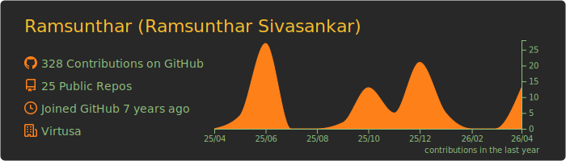
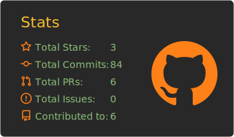

------

---

**`Backend-focused Software Engineer • Building scalable, user-focused applications • Exploring AI & Cloud`**

I’m Ram (Ramsunthar), a software engineer who likes building backend systems that behave, APIs that make sense, and projects that ship before motivation expires. I write on Medium to document lessons learned, share practical tips, and occasionally admit what went wrong so you don’t have to. I’m always on the lookout for simple, useful project ideas and product problems worth solving, especially the kind that can grow from a weekend build into something real.

---

## 🧰 Languages and Tools

---
## ✍️ Latest Articles

<!-- BLOG-POST-LIST:START -->
- [Container-less Application](https://medium.com/nerd-for-tech/container-less-application-e602b9a49b27?source=rss-939c04bf8a50------2)
- [Introduction to Container-based Development](https://medium.com/nerd-for-tech/introduction-to-container-based-development-39b080d6535a?source=rss-939c04bf8a50------2)
- [Design Patterns part 1 — Factory Method Pattern](https://ramsunthar.medium.com/design-patterns-part-1-factory-method-pattern-5783cd69f3b0?source=rss-939c04bf8a50------2)
- [Design patterns part 1 — Singleton pattern](https://medium.com/nerd-for-tech/design-patterns-part-1-singleton-pattern-2eca51192757?source=rss-939c04bf8a50------2)
- [Modern Javascript](https://medium.com/nerd-for-tech/modern-javascript-a5c7dd9c2b07?source=rss-939c04bf8a50------2)
<!-- BLOG-POST-LIST:END -->
➡️ **See more posts on Medium:** [medium.com/@ramsunthar](https://medium.com/@ramsunthar) 

---

## 📊 Stats

